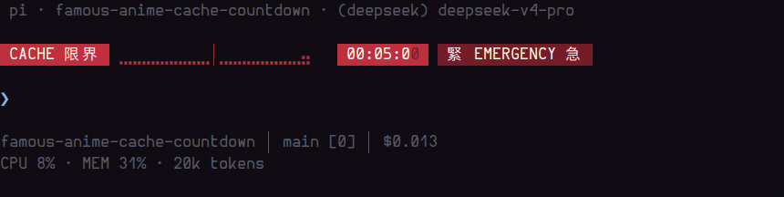

# pi-flcc

<p align="center">
  <a href="README.md">English</a> |
  <a href="README.zh-CN.md"><strong>简体中文</strong></a> |
  <a href="README.ja.md">日本語</a>
</p>

动画风格的 prompt-cache TTL 倒计时，用于 [pi](https://github.com/earendil-works/pi) —— 一个单行 widget，显示你的 Anthropic 提示词缓存条目还剩多久失效（默认 TTL 5 分钟）。


```
 CACHE 限界  ⣤⣿⣿⣿⣿⣿⣿⣿⣿⣿│⣿⣿⣿⣿⣿⣿⣿⣿⣿⣿ ●  04:52:64   NORMAL
```

## 演示

DeepSeek 12 小时宏观模式（未声明 TTL、实测缓存存活 ≥ 12 小时的 best-effort 缓存）：


完整 5 分钟生命周期，压缩到约 15 秒 —— 五个阶段、末秒闪烁，然后是过期三阶段消解：


缓存断掉那一刻的特写：进度条 + 时间自右向左收拢，` 终 OVER 了 ` 呼吸闪烁 3 次，` CACHE EXPIRED 限界突破 ` 永久保留：



待机 → 首次请求点亮：


GIF 由真实扩展代码生成（`demo-frames.mjs` 出帧，经 `player.mjs` 在真实 Alacritty 中播放、`record_gifs.sh` 录制）。对真实 pi TUI 的 E2E 验证（pty 驱动）见 `e2e_tui.py` —— 报告：`docs/e2e/report.md`。

## 特性

- **一行、五个状态**（TTL 五等分）：`NORMAL`（绿）→ `注 CAUTION 意`（黄）→ `危 DANGER 険`（橙）→ `緊 EMERGENCY 急`（红）→ 反相闪烁 EMERGENCY（最后五分之一）
- 20 格盲文进度条（每格 3 个垂直子级 = 60 步），中央分水岭刻度
- `MM:SS:cc` 倒计时 + 柔和脉冲 `●`；百分秒自然滚动（83ms 渲染 tick，与 10ms 数字周期不整除）
- **过期后分三阶段消解**（逐帧预览：`node preview-expire.mjs --frames`）：
  1. 「⣀⣀⣀⣀⣀⣀⣀⣀⣀⣀│⣀⣀⣀⣀⣀⣀⣀⣀⣀⣀ 00:00:00」自右向左逐格收拢，直到完全消失（1.2s）
  2. 「 终 OVER 了 」呼吸闪烁 3 次（700ms/次，一峰比一峰暗）后消失（2.1s）
  3. 「 CACHE EXPIRED 限界突破 」徽章永久保留，直到下一次请求让倒计时复活
- **正确的触发语义**（对齐 pi 内置 `cache-warmer`）：倒计时在请求*发出*时（`before_provider_request`）重置，而不是在响应报告缓存使用时；保活重放（`cache_warming_decision`）同样会重置。TTL 取自 `model.promptCache[short|long]`（支持 `PI_CACHE_RETENTION=long`），兜底 300 秒。
- **礼貌的 UI 公民**：通过 `setWidget` 渲染，从不接管你的 footer；也可选 `footer` 位置——经 `setStatus` 进入 footer 体系（如 pi-slim-footer 插件行），不替换 footer 本身。会话的首次请求之前什么都不显示。
- **窄终端自适应三档缩略**（收窄丢列、永不截断；盲文格数永远最先砍，`●` 永不丢）：L1 ≤66 格（丢中央刻度 + 盲文 20→10）、L2 ≤50 格（盲文→4 + 状态中英取短 ` 注 CAUT 意 `）、L3 ≤26 格（盲文→2 + 砍 cc）。阈值见 `tui_compact_design.md`，真彩预览 `node preview-compact.mjs`。
- **DeepSeek 12 小时模式**（`provider`/`id` 匹配 "deepseek"、未声明 `promptCache` 的模型）：
  ```
   CACHE DEEPSEEK  ⣿⣿⣿⣿⣿⣿⣿⣿⣿⣿│⣿⣿⣿⣿⣿⣿⣿⣿⣿⣿  11:59:50   長 EXTERNAL 期   HIT 96%
  ```
  DeepSeek 的提示词缓存没有固定 TTL（实测 ≥ 12 小时），因此你得到一个蓝色的 12 小时宏观倒计时，以 `HH:MM:SS` 显示。**HIT %** 徽章显示上次响应的真实缓存命中率，免费取自 `usage.prompt_cache_hit_tokens`（pi 映射为 `cacheRead`）。剩余 5 分钟时无缝切换到五阶段短逻辑。
- **本地/自托管 ∞ 模式**（未声明 `promptCache`、非 DeepSeek、且 `baseUrl` 指向 loopback/私网的模型——vLLM、SGLang、ollama、qwen-local 等）：
  ```
   CACHE 無限
  ```
  本地 server 的 KV cache 活在 server 进程内存里，没有 TTL——倒计时只会误导。所以只显示一个静态蓝徽章：无条、无时钟、无 `●`、无闪烁。与 DeepSeek 共用蓝系（同属「长期、不用盯」的一族）。

## 安装

```bash
pi install npm:pi-flcc
# 或从源码安装：
pi install https://github.com/fishing-dev-sm/pi-famous-anime-cache-countdown
```

## 命令

| 命令 | 作用 |
|---|---|
| `/facc` | 设置菜单。菜单 1：widget 位置 `aboveEditor` / `belowEditor` / `footer`；菜单 2：主题 `theme1`（语言品牌色，默认）/ `theme2`（原版 Tailwind）（持久化到 `~/.pi/agent/facc.json`，实时生效） |

## 开发

- `preview.mjs` —— 真彩 ANSI 设计预览（`node preview.mjs`）
- `preview-compact.mjs` —— 三档缩略模式真彩预览（`node preview-compact.mjs`）
- `test-render.mjs` —— 渲染每个阶段的样例（`node test-render.mjs`）
- `demo-frames.mjs` + `player.mjs` + `record_gifs.sh` —— GIF 管线：用真实渲染函数出帧，在 Xvfb 虚拟屏上的真实 Alacritty 中播放，用 ffmpeg 录制（`./record_gifs.sh [scene ...]`）
- `tui_design.md` —— 设计笔记；`tui_compact_design.md` —— 缩略模式设计稿
