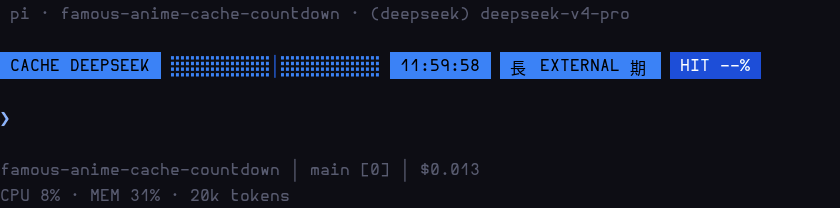
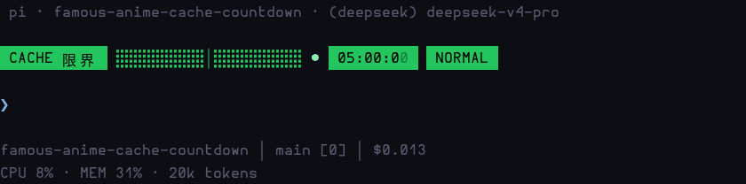
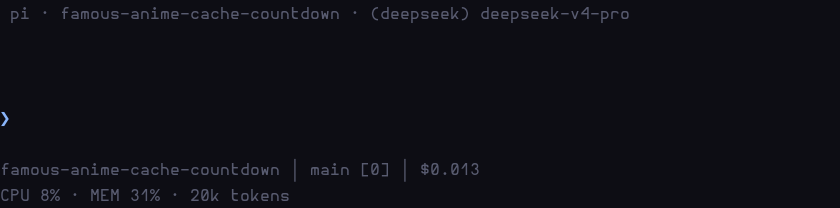

# pi-flcc

<p align="center">
  <a href="README.md">English</a> |
  <a href="README.zh-CN.md"><strong>简体中文</strong></a> |
  <a href="README.ja.md">日本語</a>
</p>

动画风格的 prompt-cache TTL 倒计时，用于 [pi](https://github.com/badlogic/lemerniss-coding-agent) —— 一个单行 widget，显示你的 Anthropic 提示词缓存条目还剩多久失效（默认 TTL 5 分钟）。


```
 CACHE 限界  ⣤⣿⣿⣿⣿⣿⣿⣿⣿⣿│⣿⣿⣿⣿⣿⣿⣿⣿⣿⣿ ●  04:52:64   NORMAL
```

## 演示

DeepSeek 12 小时宏观模式（未声明 TTL、实测缓存存活 ≥ 12 小时的 best-effort 缓存）：



完整 5 分钟生命周期，压缩到约 12 秒 —— 五个阶段、末秒闪烁，然后是「限界突破」：



待机 → 首次请求点亮：



GIF 由真实扩展代码生成（`demo-frames.mjs` 出帧，经 `player.mjs` 在真实 Alacritty 中播放、`record_gifs.sh` 录制）。对真实 pi TUI 的 E2E 验证（pty 驱动）见 `e2e_tui.py` —— 报告：`docs/e2e/report.md`。

## 特性

- **一行、五个状态**（TTL 五等分）：`NORMAL`（绿）→ `注 CAUTION 意`（黄）→ `危 DANGER 険`（橙）→ `緊 EMERGENCY 急`（红）→ 反相闪烁 EMERGENCY（最后五分之一）
- 20 格盲文进度条（每格 3 个垂直子级 = 60 步），中央分水岭刻度
- `MM:SS:cc` 倒计时 + 柔和脉冲 `●`；百分秒自然滚动（83ms 渲染 tick，与 10ms 数字周期不整除）
- 过期时：`CACHE EXPIRED 限界突破  00:00:00  終 OVER 了`（全红）
- **正确的触发语义**（对齐 pi 内置 `cache-warmer`）：倒计时在请求*发出*时（`before_provider_request`）重置，而不是在响应报告缓存使用时；保活重放（`cache_warming_decision`）同样会重置。TTL 取自 `model.promptCache[short|long]`（支持 `PI_CACHE_RETENTION=long`），兜底 300 秒。
- **礼貌的 UI 公民**：通过 `setWidget` 渲染，从不替换你的 footer；会话的首次请求之前什么都不显示。
- **DeepSeek 12 小时模式**（`provider`/`id` 匹配 "deepseek"、未声明 `promptCache` 的模型）：
  ```
   CACHE DEEPSEEK  ⣿⣿⣿⣿⣿⣿⣿⣿⣿⣿│⣿⣿⣿⣿⣿⣿⣿⣿⣿⣿  11:59:50   長 EXTERNAL 期   HIT 96%
  ```
  DeepSeek 的提示词缓存没有固定 TTL（实测 ≥ 12 小时），因此你得到一个蓝色的 12 小时宏观倒计时，以 `HH:MM:SS` 显示。**HIT %** 徽章显示上次响应的真实缓存命中率，免费取自 `usage.prompt_cache_hit_tokens`（pi 映射为 `cacheRead`）。剩余 5 分钟时无缝切换到五阶段短逻辑。

## 安装

```bash
pi install npm:pi-flcc
# 或从源码安装：
pi install https://github.com/fishing-dev-sm/pi-famous-anime-cache-countdown
```

## 命令

| 命令 | 作用 |
|---|---|
| `/facc` | 设置菜单。第一个菜单：widget 位置 `aboveEditor` / `belowEditor`（持久化到 `~/.pi/agent/facc.json`，实时生效） |

## 开发

- `preview.mjs` —— 真彩 ANSI 设计预览（`node preview.mjs`）
- `test-render.mjs` —— 渲染每个阶段的样例（`node test-render.mjs`）
- `demo-frames.mjs` + `player.mjs` + `record_gifs.sh` —— GIF 管线：用真实渲染函数出帧，在 Xvfb 虚拟屏上的真实 Alacritty 中播放，用 ffmpeg 录制（`./record_gifs.sh [scene ...]`）
- `tui_design.md` —— 设计笔记
